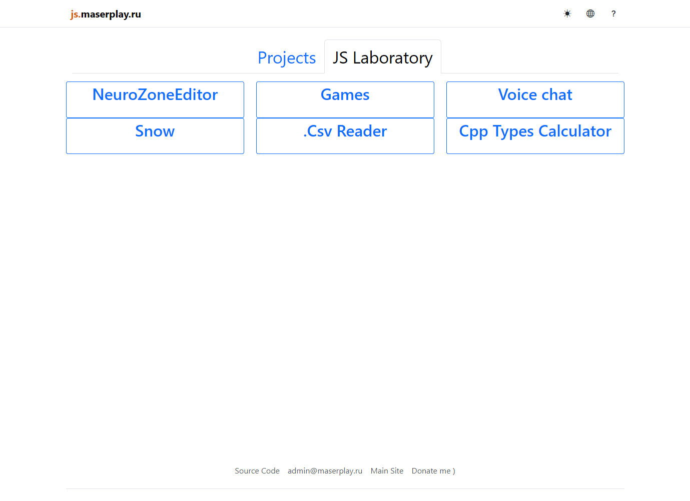

# **This is the site repository of [js.maserplay.ru](https://js.maserplay.ru)**

On this site, I am experimenting with different javascript, typescript and node.js solutions.

The main page uses the GitHub API to parse the /content folder and convert the received data into a table from the cards. 
- All my experiments are stored in the /content folder.

# Building
To build this site install `node.js`, `git`
and run following commands:

- `git clone https://github.com/MaserPlay/js_site.git`  To clone git repository
- `rmdir /s/q build`  To clear build folder
- `npm i`  To init nodejs solution
- `npm install typescript --save-dev`  To install typescript. It is not set by default because I am using global typescript.
- `npm run build -- ` To build server to build dir. Add the following args, if need: `-clear` to clear build repo *or* `-watch` to use `--watch` in the typescript. (Copying and minification are disabled. I want to add this in future)
- `npm start` To run server

# Main website
My main website is [maserplay.ru](https://maserplay.ru).